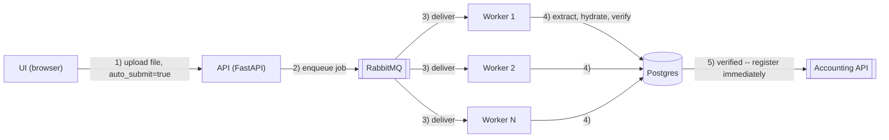
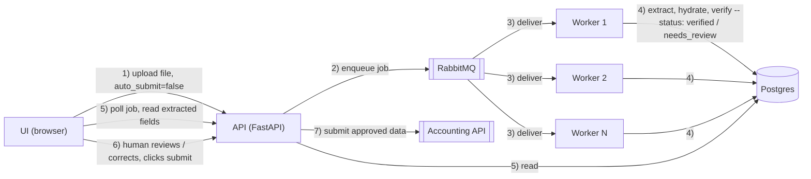

# Invoice Intake

Automates reading supplier invoices, verifying what was read, and registering
them into the (mock) accounting system — with a human review step in
between, since blind automation is exactly what almost caused a duplicate
payment per the client's brief. See `SUBMISSION.md` for the full writeup.

**Demo video:** https://youtu.be/BsikeXZiBuI

## Run it

Requires Docker.

```bash
docker compose up --build
```

Then open **http://localhost:8000/**.

That one command starts everything: Postgres, RabbitMQ, the mock accounting
API (unmodified, from the assignment), the intake API, and the worker.

## Using it

1. Open http://localhost:8000/ and upload one of the sample invoices from
   `invoices/`.
2. Leave **auto_submit** unchecked to review the extracted fields yourself
   before they're sent to the accounting system, or check it to submit
   automatically once verification passes.
3. The page polls the job and shows either a review form (fields you can
   correct before submitting) or the final registration result.
4. Visit http://localhost:8000/jobs to see every job processed so far.

## Architecture

**Auto submit** (`auto_submit=true`): a verified invoice is registered immediately, no human involved.



If verification fails even with `auto_submit=true` (unresolved supplier, duplicate, math mismatch), there's nothing to auto-submit — that job falls back to the manual path instead of step 5.

**Manual submit** (`auto_submit=false`, or verification failed): a human reviews/corrects the extracted fields before anything is registered.



- **`accounting-api/`** — the mock accounting system from the assignment, unmodified.
- **`api/`** — FastAPI service: file upload, job polling, human-submit endpoint, and the review UI (`api/app/static/`).
- **`worker/`** — consumes RabbitMQ, runs the extract/hydrate/verify/register pipeline (`worker/pipeline.py`).
- **`docker-compose.yml`** — wires everything together.

Extraction (`worker/llm_client.py` for PDFs, `worker/ocr_client.py` for
images) is currently **mocked** with hand-transcribed data for the 12
sample invoices — see `SUBMISSION.md` section 3/4 for why, and where a real
LLM/OCR call would plug in.

## Resetting local state

```bash
docker exec invoice-extractor-postgres-1 psql -U invoices -d invoices -c "delete from jobs;"
curl -X DELETE http://localhost:8080/invoices -H 'X-API-Key: demo-key-1234'
```

## CI

`.github/workflows/build.yml` builds every image and boots the stack on
every push/PR, to catch a broken build before it reaches a reviewer.
