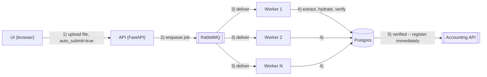
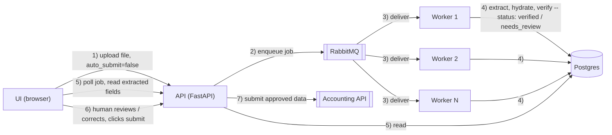

# Submission

- Name: Zhalok Rahman
- Submission date (YYYY-MM-DD): 2026-08-22
- Hours actually spent: 6 (three 2-hour sessions across two days)
- Repository / how to run it: https://github.com/zhalok/invoice-extractor — `docker compose up --build`, then open http://localhost:8000/. See `README.md` for details. Demo video: https://youtu.be/BsikeXZiBuI

## 1. Understanding the request

The client's email describes two problems bundled together: (1) manual invoice data entry is slow and causes month-end overtime, and (2) a typo in that manual process almost caused a duplicate payment. The literal request is "read invoices with AI and enter them automatically."

I read the actual problem as narrower than "automate data entry end to end." The near-double-payment incident is the real signal in the email — it's not really an efficiency complaint, it's a trust/safety complaint. A system that reads invoices with AI and blindly submits whatever it reads would make that exact failure mode *worse*, not better, since it removes the human who currently (barely) catches mistakes. So the problem I set out to solve was: **reduce manual re-typing while making it structurally harder, not easier, to pay the same invoice twice or pay a wrong amount** — which means the extraction step is the least important part to get right, and the verification/duplicate-detection step in front of the accounting system is the part that actually earns the client's trust.

That reframing drove the whole design: extract → hydrate → **verify** → register, with the verify stage as the one that's non-negotiable and the extraction stage explicitly mocked (see section 3 and 4) because it wasn't the risk the CEO was actually worried about.

## 2. What you would have asked the client

| What you wanted to ask | The assumption you made | Why |
|---|---|---|
| What counts as a "duplicate" invoice — same invoice number, or same supplier + amount + date (in case a supplier reuses numbering)? | Same `invoice_number` + `partner_code`, matching the accounting API's own `DUPLICATE_INVOICE` definition exactly. | The accounting system is the system of record; inventing a different duplicate policy than the one it already enforces would create two disagreeing sources of truth. |
| Should an invoice from a supplier not in the partner master be auto-created, fuzzy-matched, or always stopped for a human? | Always stop for a human — never guess a `partner_code`. | A wrong supplier match misdirects a real payment, which is a worse outcome than a slower one. This directly matches the CEO's stated fear. |
| Is `auto_submit` a decision made per invoice, per supplier (e.g. "trust this supplier after N clean invoices"), or per batch? | Per-invoice flag, set by whoever uploads. | Simplest thing to build and test correctly in the time available. A per-supplier trust policy is a natural next step (see section 8) but needs real production history to calibrate against. |
| Which LLM/OCR vendor is acceptable, and are there data-residency or confidentiality constraints, given invoices contain real bank account numbers and company registration IDs? | Don't send real documents to a third-party vision API at all for this submission — mock the extraction instead. | No provider was specified, no data-handling agreement was described, and defaulting to "send Japanese suppliers' banking details to whichever API I personally have a key for" felt like the wrong default to make unilaterally. |
| What should happen to an invoice that fails verification — sit forever, expire, escalate after N hours? | Sits indefinitely in `needs_review` until a human acts (no expiry/escalation implemented). | Out of scope for 8 hours; flagged as a real gap in section 8. |

## 3. Scoping decisions

**What you built**

- Full async pipeline: upload → Postgres job row → RabbitMQ → worker → **extract** (mocked LLM for PDFs / mocked OCR for images, routed by file type) → **hydrate** (resolve supplier name/alias → `partner_code` and tax rate → `tax_code` against the *live* accounting API reference data; normalize kanji/slash/Reiwa-era dates to `YYYY-MM-DD`) → **verify** (recompute subtotal/tax/total using the exact same per-tax-code floor logic as the accounting API's own source, plus duplicate detection against both our own job history and the accounting system's registered invoices) → **register** (`POST /invoices`).
- A human-in-the-loop control: an `auto_submit` flag per upload. When false, the pipeline stops at `verified`/`needs_review` and a human reviews/corrects a real form (not raw JSON) before submitting; when true, a verified invoice registers immediately with no human step, but a failed verification still stops for a human regardless — nothing guessed ever gets submitted.
- A basic web UI: upload page with live polling and inline review form (populated from the accounting system's real partner/tax-code lists), plus a separate `/jobs` page to browse everything processed.
- `docker compose up --build` as the single start command, running Postgres, RabbitMQ, the unmodified mock accounting API, the FastAPI intake service, and the worker together.
- A GitHub Actions workflow that builds every image and boots the stack to catch a broken build/compose file before it reaches a reviewer.

**What you left out, and why**

1. **A real LLM/OCR call.** This is the single biggest thing left out, and it's left out deliberately, not by running out of time: I mocked extraction with hand-transcribed ground truth from actually reading all 12 samples, so the rest of the system (which is what this assignment is mostly scoring — architecture, verification, integration) could be built and tested for free and deterministically, without per-call cost or model flakiness slowing down iteration. Validating a real model's Japanese-invoice accuracy is a separate exercise from building the pipeline around it, and the two mock modules (`worker/llm_client.py`, `worker/ocr_client.py`) are purpose-built as the exact, isolated place a real integration plugs in.
2. **Confidence-based routing.** The mock extraction stores a confidence score and free-text notes per invoice (e.g. flagging handwritten corrections), but nothing thresholds on them yet — every job goes through the same deterministic checks regardless of extraction confidence. Cut because the 12 samples' actual problems (duplicate, rounding error, unknown supplier) are all caught by deterministic checks already; a calibrated confidence policy needs real model output to tune against, which I don't have.
3. **Auth on the intake API/UI.** Anyone with network access can upload or submit. Fine for a local demo, not for anything real.
4. **Caching of reference data.** `GET /partners` and `GET /invoices` are re-fetched on every hydrate/verify call, with no cache. Invisible at 12 invoices, a real cost/latency problem at volume (see section 7).
5. **Automated tests.** I verified every stage by hand (curl, direct DB checks) against the real mock accounting API after each change, rather than writing a pytest suite, to spend the limited time on breadth (full pipeline + UI + CI) rather than coverage. This is the item I'd fix first with more time (section 8).

## 4. Design and technology choices

**Flow, end to end:** Browser uploads a file → FastAPI (`api` service) saves it to disk, inserts a `jobs` row in Postgres (`status=queued`), publishes the job id to RabbitMQ, returns immediately. A worker process consumes the queue and walks the job through `extracting → hydrating → verifying → (needs_review | verified | registering) → (done | failed)`, persisting each stage's output to the job row so it can be polled at any point. If `auto_submit=false`, the worker stops at `verified`/`needs_review` and waits for `POST /jobs/{id}/submit` (optionally with a human-corrected payload); the UI polls the job and pops open a review form the moment it's ready.

**Why async at all:** the slow, failure-prone steps (an LLM/OCR call, a call to an external accounting system) shouldn't hold open an HTTP connection or block the next upload — decoupling intake from processing means the API stays responsive under a burst of uploads (e.g. everything arriving at month-end) and a slow/rate-limited model call doesn't cascade into request timeouts.

**Architecture — auto submit:**

If verification fails even with `auto_submit=true` (e.g. an unresolved supplier, or a duplicate), there is nothing to auto-submit — that job falls back to the manual path below instead of step 5.

**Architecture — manual submit:**

Steps 1–4 are the same shape in both diagrams: upload, queue, one of several workers picks it up, extracts/hydrates/verifies and writes the result to Postgres. They diverge at what happens once the result lands in Postgres — auto submit registers immediately with no human involved; manual submit waits for a human to read the extracted fields, correct them if needed, and explicitly submit.

Running multiple workers (shown in both diagrams) is also the whole bulk-processing story — see below.

**Chose:**
- **Postgres** for job state — durable, and lets the duplicate check query job history directly (`WHERE hydration->payload->>invoice_number = ...`) rather than needing a separate index.
- **RabbitMQ** — decouples upload from processing, matches how this would scale once extraction is a real, rate-limited external API call.
- **Docker Compose** — one command boots the whole stack including the (unmodified) mock accounting API as its own service, closest to how it'd integrate with a real external system.
- **FastAPI** — fast to stand up a small REST + static-file service with async upload handling.
- **Vanilla HTML/JS for the UI** — no build step, fastest path to something demoable in the time available; a form (not a JSON textarea) once asked for, backed by the accounting API's real `/partners` and `/tax-codes` for the dropdowns rather than free text.

**Decided against:**
- **A real LLM/OCR call** during development (see section 3) — the swap point is isolated and ready, not implemented.
- **A SPA framework** for the review UI — a review form doesn't need one, and it would have cost time better spent on the pipeline.
- **Migrations (Alembic)** — schema is small and changed several times during development; I used SQLAlchemy's `create_all` and reset the dev database by hand each time instead. This is a real gap for production (see section 8).
- **A shared Python package between `api` and `worker`** — I duplicated the small `db.py`/`models.py` in both services instead, to keep each Docker build context independent. A deliberate, small duplication rather than adding a shared-package build step for two files.

**LLM/OCR service used, and why:** none actually called. Extraction is mocked with data I transcribed by directly reading all 12 sample invoices. If wiring in a real integration next, my default would be Claude's vision-capable models — the assignment itself notes current models handle Japanese invoices well, and Claude was already doing the reading-and-transcribing work in this session, so it's a proven fit for this exact document type. It would slot in behind `worker/llm_client.py` (PDFs) and `worker/ocr_client.py` (images) with no change to hydrate/verify/register.

**Plan for bulk processing.** Only single-file uploads were tested, but the architecture was chosen with a batch of invoices (e.g. a month-end drop of 50+) in mind, and needs no redesign to get there:

- **Fan-out at intake, not in the pipeline.** A bulk-upload endpoint (multiple files, or a zip) would just loop and create one job + one queue message per invoice, reusing `pipeline.extract/hydrate/verify/register` completely unchanged — each invoice is already an independent unit of work with its own job row, so "bulk" is purely an intake-layer concern.
- **Horizontal scaling on the consumer side.** The worker already consumes via a durable RabbitMQ queue with `prefetch_count=1` — running multiple worker replicas (`docker compose up --scale worker=4`, or more workers in a real orchestrator) lets RabbitMQ distribute jobs across them with no code change, since nothing about a job depends on which worker processes it.
- **Backpressure toward the LLM/accounting APIs is a real constraint, not a detail to skip.** A burst of 50 simultaneous extraction calls could hit a real vision-API's rate limit; the queue naturally throttles this by capping worker concurrency rather than firing all 50 at once, but the actual concurrency limit would need tuning against whatever rate limits the real LLM provider and the real accounting system impose.
- **A batch-level view in the UI** — grouping jobs by an upload batch id ("43/50 done, 2 needs_review, 5 in progress") — is the one piece of UI that doesn't exist yet; today the `/jobs` page only shows a flat list, which is fine at 12 invoices, and needed at 50+.

The only structural additions versus the diagram above are a fan-out at intake (one job per invoice in a batch, instead of one job per upload) and a `batch_id` grouping for polling — the workers themselves are already drawn as multiple in the diagram, and the per-invoice pipeline (extract → hydrate → verify → register) doesn't change at all.

## 5. How you used AI, and how you checked it

**What you delegated to AI**

Claude (this session) was used throughout: designing the pipeline architecture interactively, writing the FastAPI/worker/verification/UI code, and — notably — reading and transcribing all 12 sample invoices (PDFs and scanned images, in Japanese) directly into the structured mock dataset that stands in for the LLM/OCR stage.

**How you verified the output**

I didn't treat generated code as trustworthy until it was exercised against the real (mock) accounting API. After every stage was implemented, I ran the actual 12 sample invoices through the live pipeline via curl and checked the resulting job status and accounting API state directly (`GET /invoices`, raw Postgres queries), not just that the code looked plausible. The math-reconciliation logic in `worker/verify.py` was deliberately written to mirror `accounting-api/accounting_api.py`'s own per-tax-code, floor-based tax calculation line-for-line, so our local pre-check and the accounting system's own rejection reasons can never quietly disagree.

**A case where the AI got it wrong**

Early in development, the worker's `print()` logging came back completely empty when I checked `docker logs` after a job ran — including the exception message from a deliberately-unimplemented stub, which should have shown `NotImplementedError`. Rather than accept "no output" as fine, I checked Postgres directly, confirmed the job had genuinely failed as expected, then tracked the empty-logs symptom down to Python's stdout buffering not being disabled in the container (no TTY attached). The fix was adding `PYTHONUNBUFFERED=1` to the worker's environment in `docker-compose.yml`. It's a small thing, but it's a real example of AI-written infrastructure silently not doing what it looked like it should do, caught only by insisting on checking actual container output rather than trusting that "the code ran without error" meant "the code did what I expected."

## 6. Integrating with the accounting system

| Invoice | Result | How you handled it |
|---|---|---|
| invoice_01.pdf | Registered (`ACC-0001`) | Clean text-layer PDF, single supplier (山田製作所 / P-1001), no issues. |
| invoice_02.pdf | Registered | 26 line items across a two-page PDF; hydration/verify handle it identically to a single-line invoice. |
| invoice_03.pdf | Registered | Mixed 8%/10% tax rates on one invoice; per-tax-code reconciliation confirmed the split tax amounts before submission. |
| invoice_04.jpg | Registered | Scanned image with an unrelated handwritten stamp ("受領 1/20 経理") near the recipient block; correctly ignored since it isn't part of the API schema. |
| invoice_05.jpg | Registered | Clean scan, multiple service lines with null quantity/unit_price on lump-sum items. |
| invoice_06.jpg | Registered | Supplier printed as the alias "ヤマダ製作所" rather than the registered legal name; resolved correctly via the partner master's alias list. |
| invoice_07.jpg | **Blocked — `needs_review`** (`DUPLICATE_IN_JOB_HISTORY` / `DUPLICATE_IN_ACCOUNTING_SYSTEM`) | Same invoice number and supplier as invoice_01.pdf, scanned a second time — this is the exact near-double-payment scenario from the client's email. Caught by the local duplicate check before ever reaching the accounting API; would also have been rejected by the API's own `DUPLICATE_INVOICE` check if submitted anyway. |
| invoice_08.jpg | Registered | Mixed 8%/10% tax rates, plus a handwritten correction to the bank account number and a handwritten "至急" (urgent) note — neither is part of the registration payload, so registration succeeds; a human reviewer would still want to see the handwriting, which is preserved in the raw extraction shown in the UI. |
| invoice_09.pdf | **Blocked — `needs_review`** (`TOTAL_MISMATCH`) | Scanned PDF (no text layer). The printed total (¥147,497) is 1 yen off from subtotal + tax as printed on the document itself (¥134,088 + ¥13,408 = ¥147,496) — a genuine error on the supplier's own invoice, not a reading error. Caught by local math reconciliation before submission. |
| invoice_10.jpg | **Blocked — `needs_review`** (`PARTNER_NOT_RESOLVED`), then registered after human correction | Supplier "新星ロジスティクス株式会社" does not appear in the partner master or any alias. The system never guesses a `partner_code`; a human used the review form to select the correct partner (demonstrated in testing by supplying a corrected payload) before submitting. |
| invoice_11.jpg | Registered | Dates printed in the Japanese Reiwa era ("令和8年2月5日") rather than Gregorian; normalized correctly to `2026-02-05`. |
| invoice_12.jpg | Registered | Contains a negative line item (a discount, △¥30,000); handled the same as any other line amount in reconciliation. |

## 7. Cost, limits, and risk in production

- **Cost per invoice:** Mocked today, so effectively $0. Estimated for a real integration using a vision-capable LLM call per invoice (~2,000 input tokens for the image + prompt, ~400 output tokens for structured JSON): roughly **$0.01–0.02 per invoice** in model cost, plus negligible compute for hydrate/verify/register (a handful of small HTTP calls and in-memory arithmetic).
- **Monthly cost at 1,000 invoices per month:** ~$10–20 in LLM cost, plus fixed infrastructure (a small always-on VM/container host for Postgres + RabbitMQ + the two services, roughly $20–50/month regardless of volume at this scale). Call it **$30–70/month** total, dominated by fixed infra rather than per-invoice cost at this volume.
- **Processing time per invoice:** Mocked extraction is near-instant; with a real LLM/OCR call, expect roughly 2–5 seconds for extraction plus well under a second for hydrate/verify/register — call it **3–6 seconds end to end**, comfortably within what an async worker can absorb even at month-end burst volume.
- **Where this breaks first:**
  1. **The duplicate check's `GET /invoices` call** (`worker/verify.py`) fetches the *entire* registered-invoice list on every single verification, with no pagination or server-side filtering available on the mock API. At 1,000/month this is fine; at real scale (tens of thousands of invoices) this becomes a slow, unbounded call on every job.
  2. **`GET /partners` is fetched fresh on every hydration**, uncached. Harmless at this volume, wasteful and slower at real volume, and fragile if the accounting API ever rate-limits.
  3. **A single worker process, prefetch_count=1** — jobs are processed one at a time. Fine for 1,000/month (~33/day), but a real month-end spike (hundreds of invoices in a few hours) would queue up rather than parallelize; horizontal worker scaling isn't wired up yet.
  4. **OCR/handwriting accuracy on genuinely poor scans** is a silent risk, not a system crash — a misread digit that still passes math reconciliation (e.g. two digits transposed in a way that doesn't change the total) would not be caught by anything in this system.
- **How you would find out if something was registered incorrectly:** Today, primarily through the same signals the client already relies on — a supplier following up on a missed/wrong payment, or the accounting team noticing something odd at month-end close. That's not good enough for production; the honest gap is that this system has no independent ground truth to check registered data against (see section 3's PO-matching discussion) beyond internal consistency and duplicate detection. A real deployment would need periodic sampling — pulling a random percentage of registered invoices and manually comparing the registered payload against the original scanned image — as a backstop against exactly the silent-misread risk above.

## 8. What you would do with another 8 hours

1. **Wire in a real LLM/OCR call** (Claude vision, behind the existing `llm_client.py`/`ocr_client.py` swap points) and validate it against the 12 samples plus a few deliberately harder ones (worse scans, more handwriting). This is the one piece of the system that isn't real yet, and it's the highest-value thing to de-risk before anyone trusts this with actual supplier invoices.
2. **An automated test suite** (pytest) covering the math-reconciliation edge cases in `verify.py`, the date-normalization/partner-resolution logic in `hydrate.py`, and an end-to-end test running all 12 sample payloads against a real accounting-api container in CI. Everything was verified by hand this round; that doesn't scale past one person's memory of what to check.
3. **Production-hardening**: cache `/partners` and `/invoices` with a short TTL instead of refetching on every job, add basic auth to the intake API/UI, and add Alembic migrations instead of `create_all`. Ordered last because none of it matters until (1) makes the extraction real and (2) makes changes safe to land without a human re-testing everything by hand.
